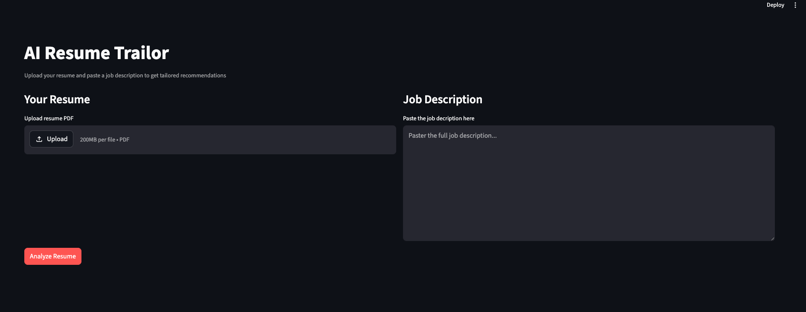
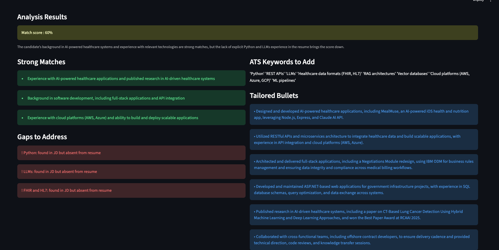

# AI Resume Tailor

AI-powered resume analyzer that compares your resume against 
a job description and returns tailored recommendations.

## Features
- Match score with explanation
- ATS keyword extraction
- Tailored bullet point suggestions
- Gap analysis with specific technologies
- PDF resume upload support

## Tech Stack
- Python, Groq API (LLaMA 3.3 70B)
- Prompt engineering — XML structured output
- Streamlit UI
- PyMuPDF for PDF extraction

## How to Run
pip install -r requirements.txt
streamlit run app.py

## Screenshots
### Input

### Results
